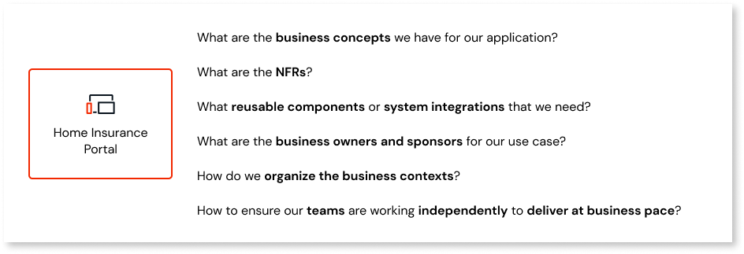
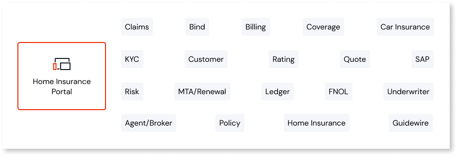
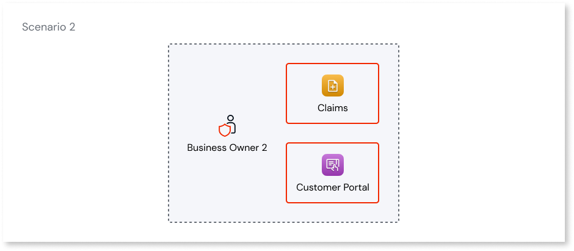
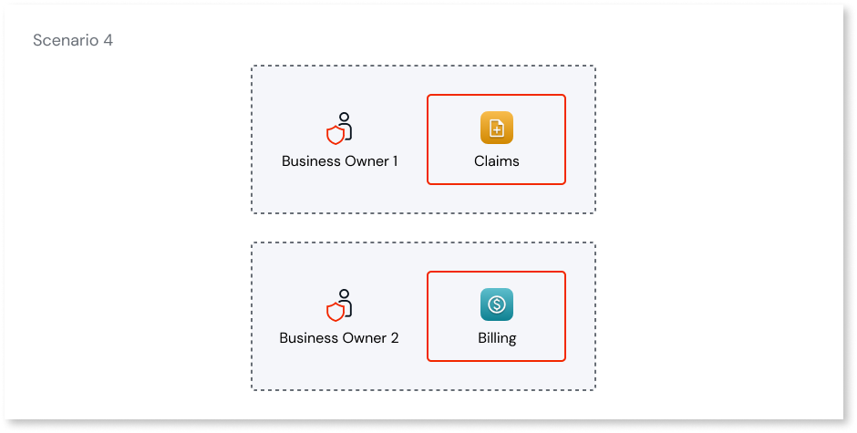
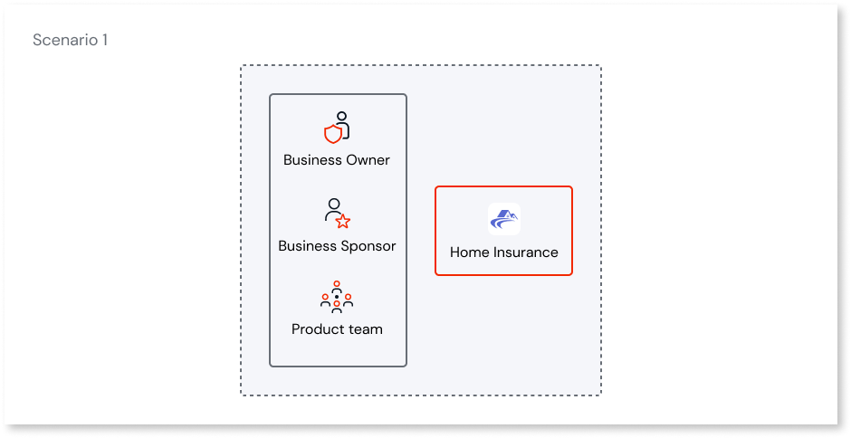
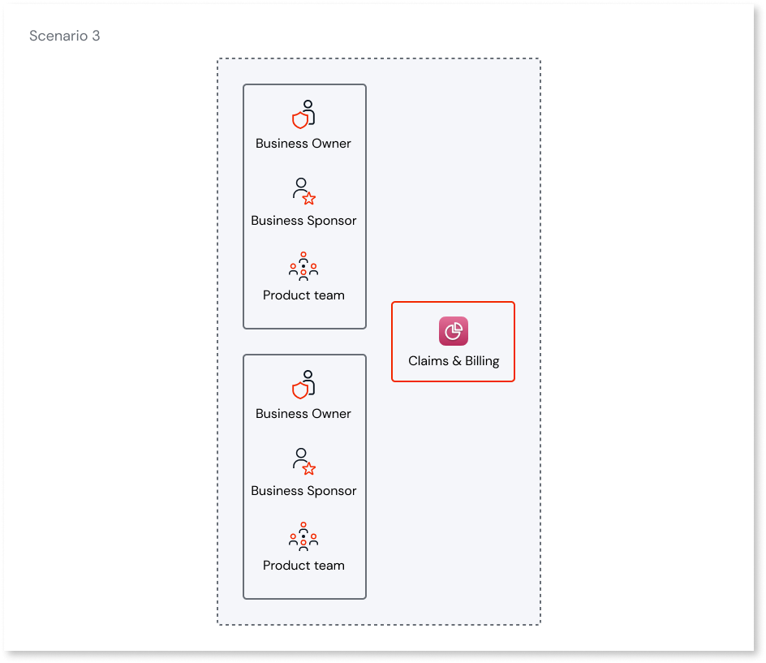
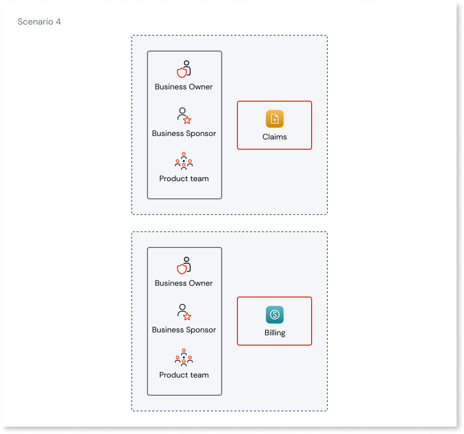
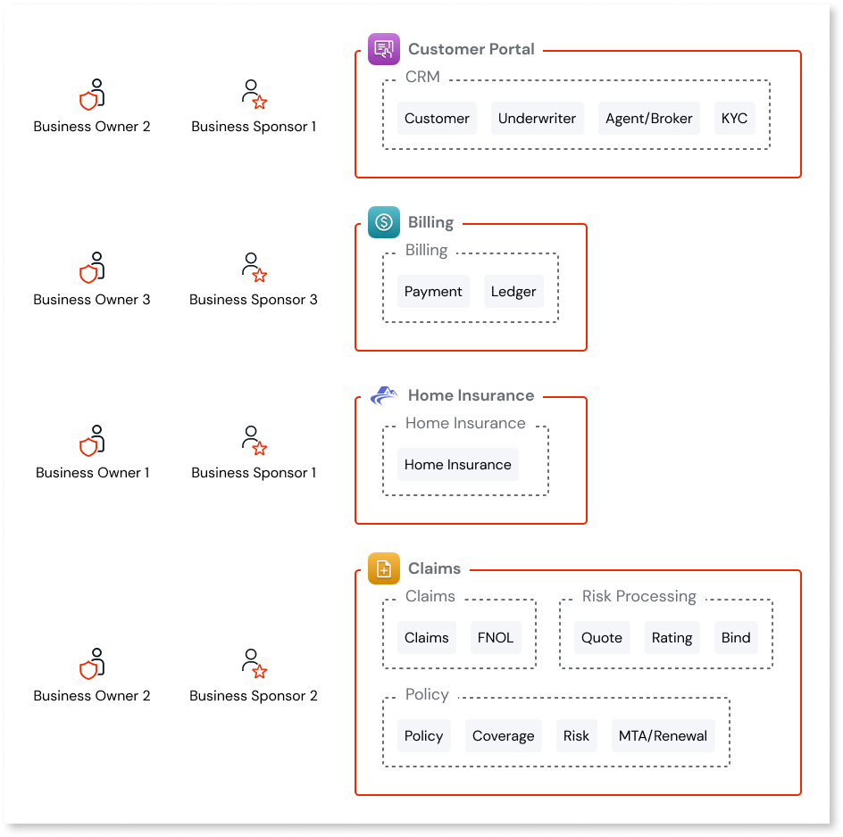

# Building a well-architected app

Before building apps in OutSystems Developer Cloud (ODC), understand the business problem you want to solve. To help you in that journey, look at an example of a home insurance portal.

Begin by asking some crucial questions. The answers become the rules you base decisions about designing and building a scalable architecture.

1. What are the business concepts in your use case?
1. What's the organizational structure?
1. Who are the business owners and sponsors?
1. How are the business owners and sponsors related to the different business contexts?
1. How can you ensure your teams can work independently and deliver at the rate of business decisions?
1. What are your non-functional requirements (NFRs), reusable components, and integrations with external systems?

These questions and answers help you think about business concepts by grouping them into bounded contexts. You can then map the bounded contexts to the organization. This mapping helps you identify the business sponsors, owners, and teams working on those apps.

The answers to the sequenced questions listed earlier become the steps to help you better design a ODC app architecture. Following is more detail about each step in the process.

## Step 1 - Discover the app business concepts

After interviews with business stakeholders and end-users, list all the business concepts you identified to build a Home Insurance portal.

It's essential to start gaining some business knowledge to ensure better design decisions based on the outcome of the workshops and interviews conducted before.

Some concepts, like **Customers**, **Claims**, and **Quotes** are easy to identify. But also think about data and external systems with data that might support other concepts. Are there concepts that might require further detailing, like **First Notice of Loss (FNOL)**, **Know your Customer (KYC)**, or **Payments**?

## Step 2 - Identify bounded contexts by grouping the business concepts

Now identify the business contexts to organize and group the business concepts.

Bounded contexts don't only group related business concepts but also take into consideration the following questions:

* What are the business domain experts' boundaries?
* What are the business processes, data flow, and ownerships?
* Is the concept's cohesion or clustering due to dependencies between concepts?

To avoid a lack of clear ownership and context segmentation, ensure you only have a few dependencies between bounded contexts. To avoid confusion, use a common language that everyone understands.

Look at the bounded concepts identified in the home insurance portal example. The concepts grouped as business context are **Home Insurance**, **Risk Processing**, **Customer Relationship Management (CRM)**, **Claims**, **Billing**, and **Policy**.

In two business contexts, we identified reusable components and integrations with external systems. In the **CRM** context, it's necessary for external integration with SAP. In the **Billing** context, there is a need to integrate with Guidewire, another external system. 

In ODC you integrate with external systems by consuming REST API services.

Finally, we have bounded contexts well identified. All these contexts can be iterated on if you identify more information.

## Step 3 - Define a clear ownership

Before assembling your final architecture design, understand how the organization's structure can impact your strategy. Following best practices to prevent mixing business owners and ensuring clear ownership is essential.

To ensure app development runs as smoothly, it's crucial to define clear ownership to avoid different requests for the same business context from various owners of the same app.

Clear ownership requires and means you have only one go-to person for each business context: the business owner.

It's important to start simple. When the business evolves, if necessary you iterate and add complexity.

### Best Practices

**Ensure clear ownership by having only one business owner** for the **Home Insurance** app.

Have one business owner for the **Claims** and **Customer Portal** apps.

If, for example, you have two owners for the **Claims & Billing** app, it might generate ineffective execution due to the:

* Unclear responsibility, unclear accountability
* Risks, collisions, and conflicting priorities caused by concurrent work

So, as a best practice, avoid this scenario.

**Avoid the downsides of having two owners simultaneously for one app.** If necessary, split **Claims & Billing** into two different apps.

#### Independent release cycles

To ensure independent release cycles, business sponsors play a crucial role in the organization.

Business sponsors are usually accountable for the budget, so they have the power to prioritize the demand. Due to that, different sponsors might require different rates of change, so it's **essential to match your architecture to the organizational structure.** In that way, you can ensure independent release cycles.

Follow the approach of starting simple. If needed, begin to add complexity over time.
 
Having one sponsor and one business owner for the **Home Insurance** app is OK.

In this scenario, it's also OK to have two sponsors and only one business owner since each sponsor matches an app (**Claims** and **Customer Portal**).

In this scenario, if we had two sponsors for the **Claims & Billing** app, we could start having problems because if each sponsor's requests change simultaneously, this may cause conflicting priorities.

So, as a best practice, avoid this scenario.

To ensure business sponsors can request changes at different rates, create two apps: one for **Claims** and one for **Billing**.

#### Team independence

Following the best practices makes it important to ensure that development teams have independent release cycles. It also enables developers to make the most of ODC and scale it to many teams working on extensive portfolios of apps and libraries.

If you only have one team, one owner, and one sponsor, start with a simple approach, using one app to implement your bounded contexts. With a simplified approach, having all the business concepts and contexts in the same app, you can gain the benefits of:

* Low development efforts
* Low architecture effort

The reason is that developers don't need to worry about exposing services from one app to another. They don't need to manage different permissions for other apps. They can also manage all the authentication and exceptions in the same app without worrying about centralizing the authentication in a single app.

There are only disadvantages if, for some reason, you have different teams that need to deliver features at varying rates in the same app, and it becomes hard to manage. However, to solve the problem, you can use feature toggling. Just remember that feature toggling requires additional development time.

In this scenario, one team can be the owner of several apps. Assuming the structure of the organization justifies it. Despite this, having a good balance between the amount of code owned and the cognitive load necessary to understand is essential. In this case, you can have independent deployments to serve different teams. If those apps don't connect, you achieve the same advantages mentioned in the first scenario.

However, if either of those two apps expose or consume a service, it becomes more complex.

A situation where you have more than one team working on the same app can lead to a lack of independence and clear ownership. In this case, you should move to a more distributed approach to meet your business needs without blockers.

So as a solution for the last scenario, split your bounded contexts implementation into more apps, because more independent ownership and release cycles are a benefit. However, this more distributed approach can lead to a more complex architecture. Therefore, you must follow development best practices to avoid significant impacts on other apps that are served by the services each team provides.

## Step 4 - Assemble the architecture

Now that you understand the fundamental best practices that ensure a proper development flow and release cycle, you can assemble your architecture.

Start by mapping your business owners and sponsors to your bounded contexts based on the command of the organization and the information collected from your stakeholders. You can now easily understand how to assemble your architecture by applying best practices.

The goal is to ensure the right balance between cohesion and loose coupling. This helps developers to reduce development effort and architecture complexity while maintaining development lifecycle independence between apps and teams.

## The final architecture

The final architecture for this example is simple but powerful. It has only four apps:

* The **Home Insurance** app that has a user interface containing screens, blocs, and a look and feel.
* The **Customer Portal** app that has aggregates and manages all the customer information and exposes that to the **Home Insurance** app.
* The **Claims** app that contains the bounded context like risk processing policies and claims as services for the Home Insurance Portal.
* The **Billing** app that contains the payments and bills to be processed. It can include services and a user interface where users can pay pending bills.

The architecture is composed of three libraries:

* **Lottie animations**, which is available in Forge and installed in your organization to enrich your end-user experience by adding some custom animations to the **Home Insurance** app.
* **SAP connector** that's used as an integration wrapper to connect your customer's information from SAP and work as a bridge to your customer portal.
* The **Guidewire connector**, that supports your billing system as an integration wrapper to process traditional and flat-rate agent commissions from a single interface.

