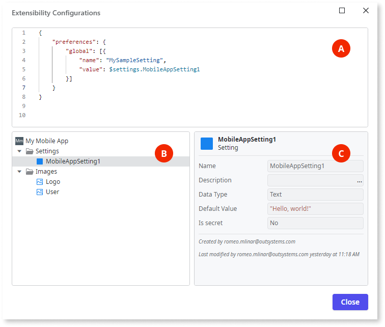

# Advanced configurations for mobile app

Use Extensibility Configurations in the app properties to create a JSON with advanced configurations. Mobile Apps Build Service (MABS) in OutSystems Developer Cloud (ODC) uses the JSON as additional settings when creating your mobile package for iOS or Android.  Extensibility Configurations lets you access options like defining a portrait or landscape orientation, splash screen, or a minimum mobile platform version.

You set the default values of Extensibility Configurations for Mobile Apps and Libraries in the ODC Studio. You can then change the values in the ODC Portal.

Here are some of the functionalities you can change with Extensibility Configurations:

* Add custom mobile plugins
* Change deep link behavior
* Configure the domains
* Customize the status bar 
* Modify the app icon
* Set up a splash screen

## Extensibility Configurations editor

In ODC Studio, open your mobile app, and under app properties go to **Advanced** > **Extensibility Configurations**. Double-click the field to open the editor.

The editor consists of the following:

* JSON text editor that checks your syntax **(A)**.
* Context pane with items you can reference buy dragging or double-clicking **(B)**.
* Details pane that lets you view the properties without closing the editor **(C)**.

## Referencing the values in the ODC Studio

In ODC Studio, go to **Data** > **Settings** and create the values you need in your app. Then, in the Extensibility Configurations editor, reference the value form the scope pane. You can also reference images you add to your app. 

## Changing the settings in the ODC Portal

Once you publish your app, go to **ODC Portal** > **(your app)** > **Configuration** > **Settings**. Select the setting you want to edit, change the value, and apply the change.

Changing the values of Setting in ODC Portal doesn't trigger automatic generation of new mobile package. See [Create mobile app package](creating-mobile-package.md) for more information on how to create a package for iOS or Android. 

## Sample use cases

Here are some of the use cases of the JSON and how you can change behavior of your mobile app.

###  Lock the screen orientation

The value is hard-coded and lock the screen to portrait.

    {
    "preferences": {
        "global": [
        {
            "name": "orientation",
            "value": "portrait",
        }           
        ]
    }
    }

### Define a custom variable

You can define a variable in  **Data** > **Settings** and the reference it.

    {
        "preferences": {
            "global": [{
                "name": "MySampleSetting",
                "value": $settings.MobileAppSetting1
            }]
        }
    }

### Define a private git repository for a custom mobile plugin

The API key is a secret setting, that you can reference in the JSON within the app, then change in the ODC Portal.

    {
    "plugin": {
        "variables":[
        {
            "name": "apiKey",
            "value": $settings.ApiKey,
        }
        ]          
    }
    }

### Reference an image

You can also reference images in the JSON file.

    {
    (...)

        "icons": {
            "android": [{
                "resource": $images.Logo,
                "density": "ldpi"
            },
    (...)
    }