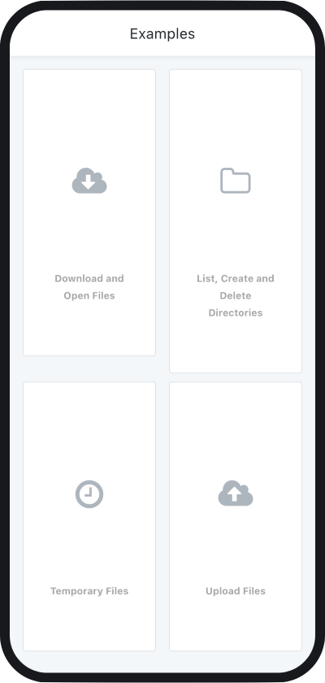
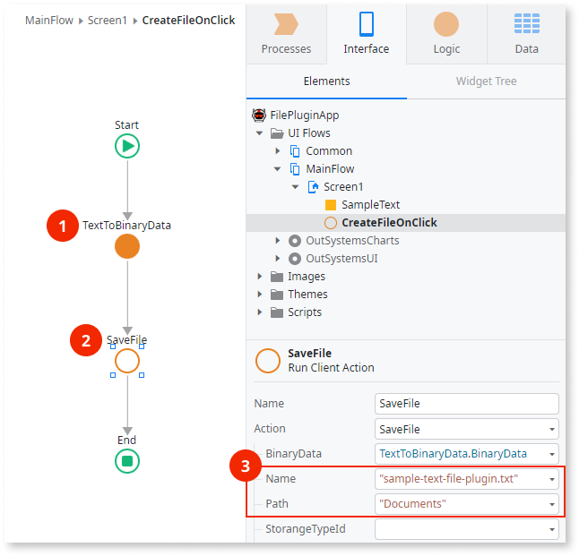

# File Plugin

Applies only to Mobile Apps.

File Plugin lets you manage files and folders on a mobile device within the app sandbox.

See [Installing plugins](../intro.md) to learn how to install a plugin in your OutSystems apps.

## Demo app

Install **File Demo App** from Forge and open the app in ODC Studio. The demo app contains logic for common use cases, which you can examine and recreate in your apps. For example, the demo app shows how to:

* Read a file
* List files
* List folders
* Save text in temporary file

## Working with binary content

File Plugin in some actions requires parameters of the binary data type. To convert data to binary you can use:

Note that **BinaryData Client Side** is a Forge plugin contributed by the OutSystems community and it's not officially supported. Actions in this plugin run in the client, and your app can **use them while offline**.

## Examples

Here are some examples of how to use File Plugin.

### Store some text in a file

The **SaveFile** requires a binary input, so you need to convert the text to binary first. Use the **TextToBinaryData** (1) action from the **BinaryData** extension (you need to reference the **BinaryData** extension first). You can then use the **SaveFile** action from **Logic** > **Client Actions** > **FilePlugin** to create a file and save text (2). Set the file name and the path in the properties (3).

Refer to [Working with binary content](#working-with-binary-content) for more information.

### Get the list of files

Use the **ListDirectory** action from **Logic** > **Client Actions** > **ListDirectory** to get the list of the files (1). The file names are in the list **ListDirectory.FileList** (2).

## Reference

More information about parts of the plugin.

### Actions

Here is the reference of the actions you can use from the File Plugin. File Plugin uses a Cordova plugin, and for more information check [cordova-plugin-file](https://github.com/OutSystems/cordova-plugin-file).

| Action                 | Description                                                       |
| ---------------------- | ----------------------------------------------------------------- |
| **CheckFilePlugin**    | Enables to check if the plugin was loaded.                        |
| **CreateDirectory**    | Recursively creates a directory in the file system.               |
| **DeleteDirectory**    | Deletes a directory and all its content in the file system.       |
| **DeleteFile**         | Deletes a single file.                                            |
| **DeleteFileFromUri**  | Deletes a single file from a URI address.                         |
| **GetFileData**        | Returns the binary file encoded in Base64.                        |
| **GetFileDataFromUri** | Returns the binary file encoded in Base64 from a file's URI path. |
| **GetFileUri**         | Returns the file's URI path.                                      |
| **GetFileUrl**         | Returns the file's blob URL path (blob://).                       |
| **GetFileUrlFromUri**  | Returns the file's blob URL path from a file's URI path.          |
| **ListDirectory**      | Lists the directory's content.                                    |
| **SaveFile**           | Saves a file in a specific directory.                             |
| **SaveTemporaryFile**  | Saves a file in a temporary directory.                            |

## Storage type

Information about the **StorageTypeId** property, which tells the app where to store the files. This property is available in some of the actions of the plugin. 

| StorageTypeId                     | Description                                                                                                     |
| --------------------------------- | --------------------------------------------------------------------------------------------------------------- |
| **Entities.StorageType.Internal** | Sandboxed app data in the internal memory. Corresponds to Cordova's **cordova.file.dataDirectory**.             |
| **Entities.StorageType.External** | App data on an external storage. Corresponds to Cordova's **cordova.file.externalDataDirectory**. Android only. |

For more information check out the document [Where to Store Files](https://github.com/OutSystems/cordova-plugin-file#where-to-store-files) from Cordova.
