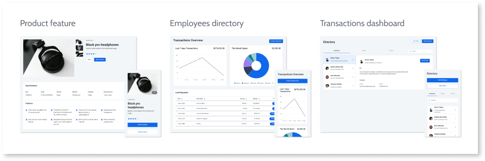

# User interface

Project Neo documentation is under construction. It's frequently updated and expanded. Leave your feedback and help us build the most useful content.

OutSystems UI enables you to quickly create applications that are professionally designed and provide a great user experience. OutSystems UI optimizes screen templates enabling you to quickly build screens for your apps that are adaptive for any device. The screens you build enable your users to see data, access menus, and navigate between screens.

When creating the UI for your applications, typically designers create screen mockups using their design tool of choice.  Developers then use those screen mockups to create the application screens and UI elements in Service Studio.

Project Neo comes with:

* Built-in screen templates that provide both UI and functionality
* UI patterns that help you build your screens

The OutSystems UI framework integrates with Service Studio. In Service Studio, you have access to screen templates and UI patterns. You can start building your UI with a screen template and then drag UI patterns onto your screen. You can also make any changes to the UI and logic. This helps you to quickly build screens and create a seamless experience for your apps. The layouts and UI adapt to the device size.

## OutSystems UI framework

The OutSystems UI framework Is the base of all user interfaces. The framework supports all apps. The UI framework is fully integrated, responsive by default, with many possibilities to extend screen templates and UI patterns.

All framework elements follow a cohesive and defined set of rules, such as colors, headings, margins, and paddings, that come from what you define in your CSS. The framework comes With dozens of responsive UI patterns that integrate with OutSystems, so that you can build the UI for your app using low code. 

Following is a list of key features of the UI Framework:

* Built for all apps
* Dozens of UI patterns
* Customizable and extendable design system
* Responsive UI
* Right-to-left support
* Accessibility compliance with WCAG 2.1
* Actions to deal with different device types

## Screen templates

A screen template includes a combination of pre-assembled elements that follow best practices to meet a functional need. Rather than starting with a blank screen, use a screen template as a starting point to build your own user interface.

Service Studio comes with default screen templates based on the OutSystems UI framework. The templates also come with sample data that helps you see how the screen looks. Each screen template can include layouts, buttons, images, tables, components, styles, and logic.

Screen templates are customizable, enabling you to create a user interface with your own data to customize your user's experience. You can quickly make changes and create your own screen templates.

Screen templates are available for all applications. The following is a list of the categories and examples of templates you can create.

* **Dashboard** includes templates for example to create an admin dashboard or request management
* **Details** include templates for example to create an employee directory and Location detail
* **Forms** include templates for example to create a product form or a Request form
* **Galleries** include templates for example to create a product catalog or a four-column gallery
* **Lists** include templates for example to create a four-column gallery or a list with a chart
* **Onboarding** includes templates for example to create screens for first time users with or without animation

## UI patterns

Since OutSystems UI is preinstalled, Service Studio has access to many pre-built patterns for common UI patterns. For example, to use an accordion or gallery pattern, drag it to a screen.

Patterns provide a standardized way to present content. When you use a standard pattern, it speeds up the development of your user interface. Patterns are available for all your apps. If you want to change the look and feel, you can edit the Cascading Style Sheet (CSS).

Additionally, you can change the structure to display something else or remove unwanted elements. You can even change the code and the pattern behavior by adding swipe gestures or new events.

UI patterns are available in many different categories such as content, navigation, and interaction. Following is a sample of some UI Patterns:

