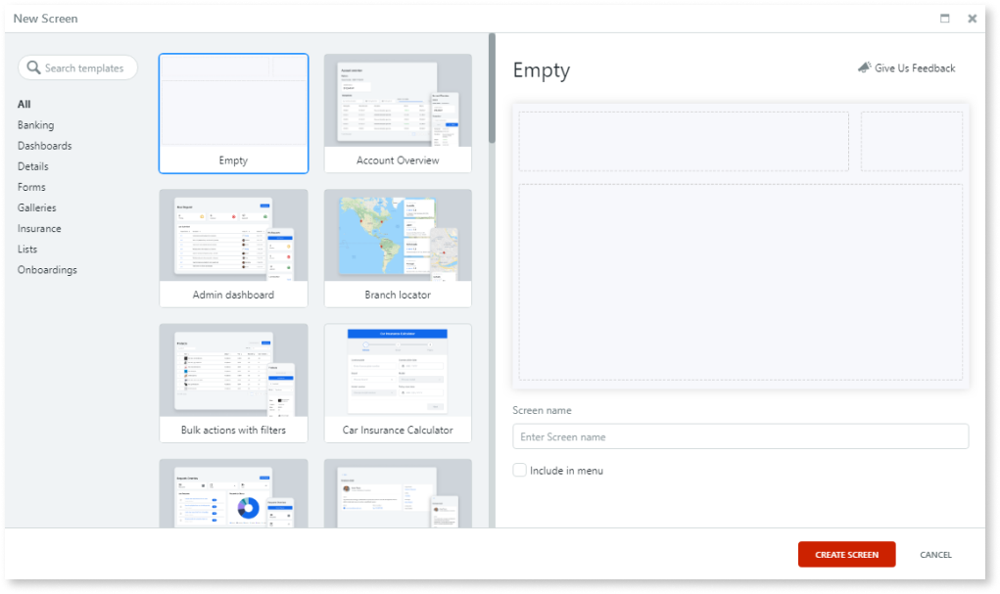
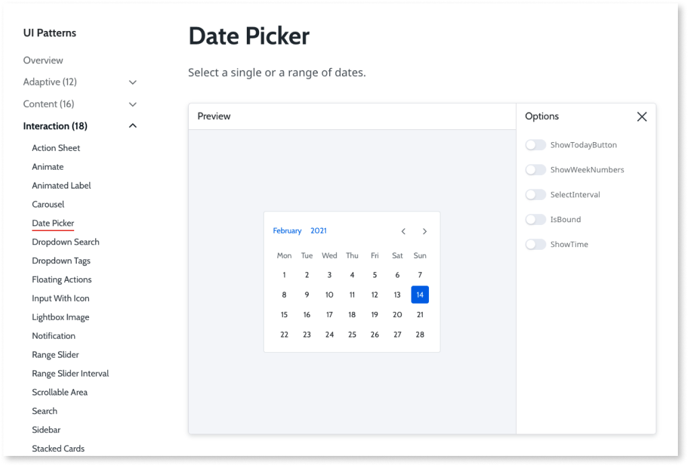

# Screens

Project Neo documentation is under construction. It's frequently updated and expanded. Leave your feedback and help us build the most useful content.

A screen is a user interface (UI) element that contains other UI elements (such as fields or labels) that enable users to interact with your app. You can create an empty screen, or from a screen template for a specific use case.

Screen templates come with UI patterns that solve common application use cases. Screen templates help accelerate development by providing common functionalities and consistent look and feel. Screen templates include UI elements, and some include sample data that you can replace. You can immediately publish screens created from a screen template enabling you to see how the screen looks or to use it to show a proof of concept.

When you create an empty screen, you start with a basic layout to which you add data and UI elements. If you want to create a screen with a specific layout, you might want to start with a screen based on a screen template.

OutSystems provides many types of elements that you can add to your screens such as links, tables, and buttons. You can make changes to the UI and logic of the screen using pre-built UI patterns, such as Columns and Lists. UI patterns are available from the Service Studio and are organized by categories such as content and interaction. You can define screen-level attributes that are specific to a screen, for example, screen name, screen title, and user roles.

To access screen templates and the blank screen layout, go to Service Studio, select the **Interface tab** > **UI Flows** > then right-click **MainFlow** and click **Add Screen**.

For a **Screen Template**, choose a category (such as Dashboard) and a template (such as Transactions Dashboard) from which you want to start.
For a blank screen with only a layout, select **Empty**.

You can replace sample data using one of the following methods:

* **Automatically** - to replace such things as data in forms, tables, lists, and Gallery elements.
* **Semi-Automatically** - to replace some data automatically and some data manually.
* **Manually** - to replace data by removing elements, and by modifying the data sources, and aggregates. This method gives you more control over screen logic.
