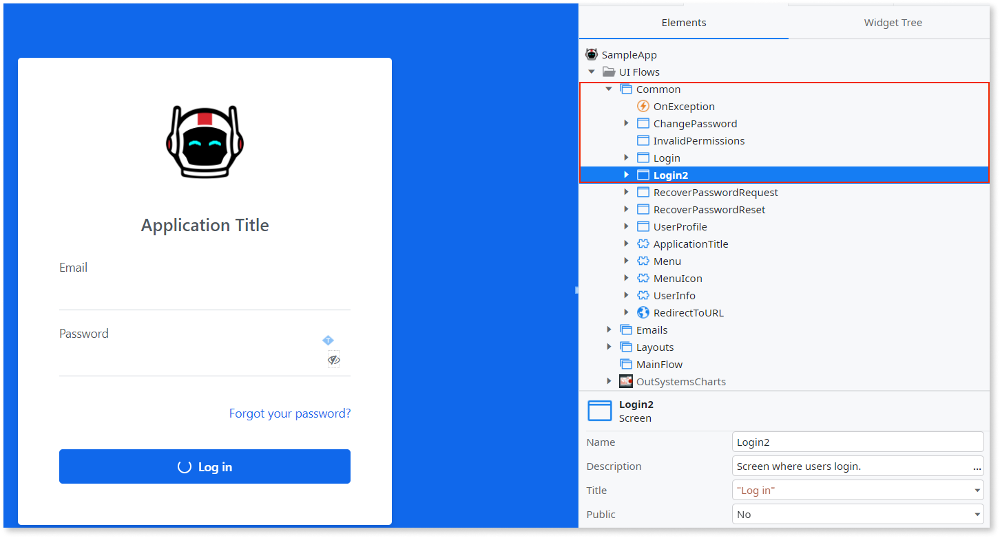
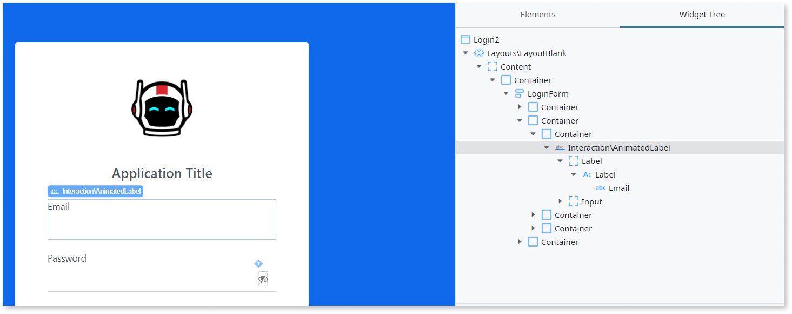
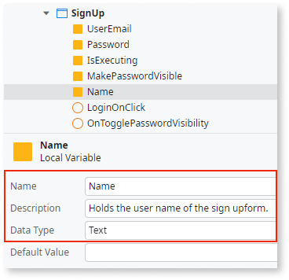

# Create a screen for users to self-register 

To enable users to self-register to access your app, you can provide end users with a screen. At the very least, end users must provide their name and email address.
  
To create a self-registration flow, open ODC studio and follow the steps below:

 1. Open ODC Studio.

1. From the **Interface** tab, click UI Flows > Common folder then  copy and paste the Login screen into the same folder. This creates a copy of Login that is named Login2 in the Common folder.

    

1. From the Common folder, click the **Login2** screen to view the settings. Then change the name to Signup, the title to "Signup", and the description to “screen where users sign up”.

1. From the **Interface** tab, click the **Widget Tree** > **Content** > **Container**, then rename "LoginForm" to "SignUpForm".

1. From the canvas, click the email label and input the fields container on the screen, then do the following:
    1. Copy and paste the specified container into the same folder.
    1. Set the Style Classes property of the new container to "margin-bottom-base".

    

1. From the **Elements** tab, click the **Sign-up screen** > **Under Variable** > **Add Local Variable**. Set the name of the new variable as **Name**, and the Data Type as **Text**.

    

1.  From the **Widget Tree**, delete the container that has the password label and input field in the Widget tree for the Signup screen. Then delete the client action **OnTogglePasswordVisibility** and the local variable **IsPasswordVisible**.

1.   In the **Signup** canvas, click the **login** button and change the text from **Log in** to **Sign-up** . Delete the **LoginOnClick** client action and Password **local variable**.

1.  From the Toolbox, drag a button onto the canvas and place it after the **Sign-up** button. Set the name to **Cancel** and select **Common\\Login** from the dropdown for the On Click event.

1.  In the **Style classes** property, replace the class **btn btn-primary** with **btn margin-top-base** and change the value of **IsFormDefault** to **No**. Then, set the **Width property** to set **Fill** in under Styles > Layout.

    
