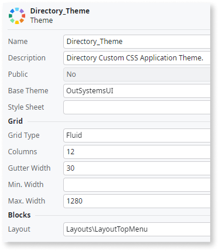
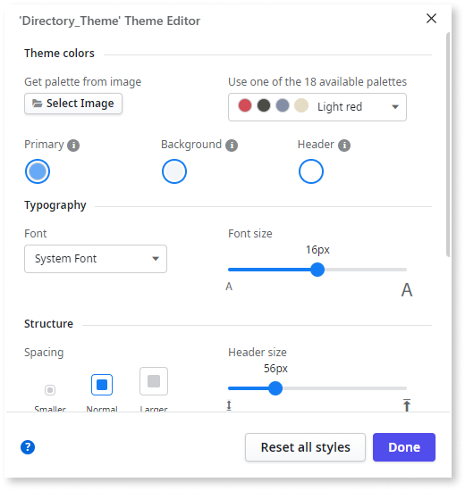

# Themes

A theme gives you the ability to style various parts of your app differently depending on the context. Themes can be simple such as one that uses different colors and backgrounds or font sizes and icons. Using CSS, you can achieve the same results as a theme by piecing together various CSS variables in a context (such as black and white) to enable a better presentation of an app.

By default, an app theme is available in every app, enabling you to customize the look and feel by adding your custom CSS. You also have the option to create multiple themes inside one app.

In **UI Flows**, you can select a specific theme, giving you a different look and feel.

## Theme properties

Theme properties enable you to define some components of your themes to ensure consistency and save development time.

* **Name** - Use a name that makes sense and makes the theme easy to identify.
* **Description** - Use to describe specific information about the theme.
* **Public** - By default, it's set to **No**, so other apps can't share. To share the same look and feel between apps, developers need to create a theme library (later in this article).
* **Base Theme** - Every theme can have a base theme. When using an existing theme as a base, the app theme leverages the custom CSS built into the base theme. For example, most OutSystems themes start with the OutSystems UI base theme. This enables developers to begin a predefined UI and structure that they can use for screens and blocks. Then developers can customize the look and feel using the app theme with a custom CSS on top of OutSystems UI CSS classes.    
*  **Grid Type** - Every theme is also related to a specific layout. Layouts use a grid system similar to a table to specify content horizontally and vertically. Like tables, a grid layout enables developers to align elements into columns and rows. However, more layouts are possible with CSS grids. It's also easier. For example, a grid container's child elements could position themselves so they overlap and layer, similar to CSS-positioned elements.
* **Columns** - You can change the number of columns for a layout grid. By default, most apps have 12 columns. However, some designers prefer to use 16 columns. This option enables you to define how the layout columns look in the app.
* **Gutter Width** - The space between columns is the gutter width. Depending on your design, the gutter can be larger or smaller. By default, most apps that use a 12 columns grid set the gutter size between 10 to 30 pixels.
* **Min. Width** - Developers can define a minimum width to specify that lower than a specific size. For example, if a developer sets the min-width as 1024px, then when users open the app it won't be responsive from 1024px to 0px. This means the app will have odd behavior on mobile and tablet. 
* **Max. Width** - This option affects the display width of your app. For example, if a developer selects the **Grid Type** as `Fluid`, the layout covers the entire width of any screen. The experience can be pretty odd to users with big monitors. Setting the width is most common when using a fluid grid with a maximum of 1366px. But it depends on the use case and the user's usage. However, developers can target better if they know which type of screens their users use.
* **Layout** - In the layout section, you can select which layout you want to use when creating a new screen. For each **UI Flow** you can have a specific theme and layout every time you add a new screen inside that **UI Flow**.

## Theme layouts

* **LayoutTopMenu** - Contains the **Menu** on the top and has a specific placeholder structure. It also includes input parameters that allow you to set if the **Menu** is fixed when scrolling the page. You can also enable accessibility features like increasing the text size and other options. As a developer, there is an input parameter to add extra CSS classes to the layout.
* **LayoutSideMenu** - Contains the **Menu** on the left as a sidebar and has a specific placeholder structure and the same input parameters. However, it has a new input parameter that allows the developer to define the **Menu** behavior to affect how the **Menu** opens as a sidebar.
* **LayoutBlank** - A layout that doesn't contain the **Menu** is usually used for the login page because it only includes one placeholder for content covering the whole screen. It has two input parameters: the enable accessibility features and the extended classes mentioned before.
* **LayoutBase** - A layout primarily used for landing pages due to its simplicity. The layout has two main placeholders: the **Header** and the **MainContent**, and already has a **Menu** on the top. Also, this layout usually contains another layout, the **LayoutBaseSection**, that allows you to define sections in the screen similar to what you find in traditional website landing pages. **LayoutBase** also includes the same input parameters as the **LayoutTopMenu**.

## Theme editor and CSS

The **Theme Editor** is an alternative option to custom CSS. Use the **Theme Editor** to change a few basic properties like primary color, secondary color, font, or font-size. The **Theme Editor** is an option that doesn't require knowledge of CSS. It's a straightforward wizard configuration that gets translated as an app theme. Behind the scenes, every change you make in the **Theme Editor** gets converted into a specific theme with custom CSS inside that you can't change directly.

## Theme libraries

Every app has a default theme that all UI flows and screens inherit. However, as a business grows, more apps need the same look and feel. To avoid copy and pasting the CSS and patterns from one app to another, use a library to centralize the look and feel. A theme library is just a way to reuse themes, layouts, images, and common patterns between apps.

The benefits of using a theme include: 

* Ensure adherence to the brand rules, user interface consistency, and foster usability.
* Optimize the development process and user experience through customized branding and visual consistency through all delivery assets.
* Promote reusability and reduce maintenance costs when different apps use the same theme.
* Promote ownership across teams to ensure design compliance between apps.

It can be a burden when organizations have multiple teams working on multiple apps that all need the same look and feel. Therefore, it's important that your developers learn how to use the theme library. 

To learn how to share the same look and feel between apps [click here](theme-library.md).
