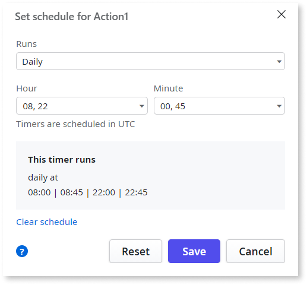
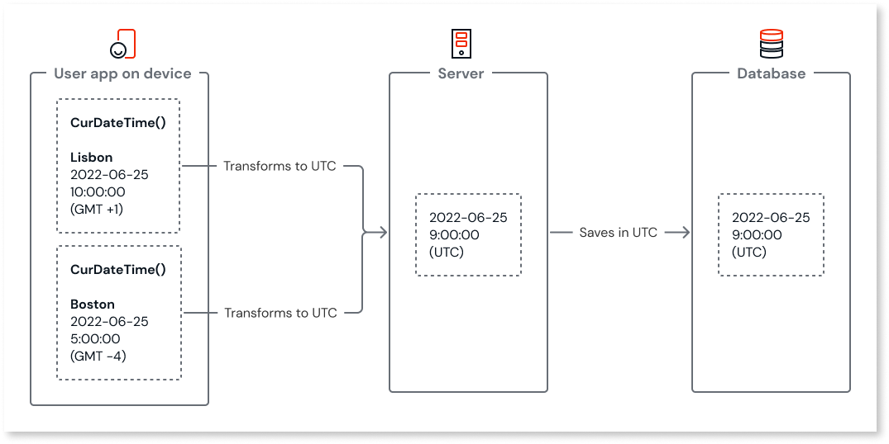

# Onboarding for OutSystems developers

This article summarizes behavior that developers familiar with OutSystems 11 may find helpful when learning about OutSystems Developer Cloud (ODC).

## Overview

ODC is a cloud-native, app development platform that provides a modular, scalable environment in which to develop and deploy your apps. ODC lets you build and deploy enterprise-grade, mission-critical apps in weeks. With ODC, you can build web apps, web portals, mobile apps, and business workflows faster than with traditional development tools. You can then deploy your apps in a scalable, secure, and high-performance environment.

ODC delivers a modern architecture based on best practices in cloud-native infrastructure, management, and operations. Benefits include:

* Scalable and reliable apps, built and deployed in a [modern container infrastructure](./../architecture/intro.md).
* Built-in security with end-to-end encryption.
* Disaster recovery, with app-level high availability configuration.  
* The ability to take advantage of the latest ODC releases with pain-free upgrades.

## Unified experience  { #ODC-portal }

The ODC Portal consolidates your app and user management experience in one place. It consolidates functionality that previously existed across LifeTime, Service Center, and the Users application.

## Build once, deploy many times

ODC uses the term **stage** instead of **environment**. A stage (Development, Test or Production) is a step within your continuous delivery pipeline that includes Runtime resources. ODC separates Platform and Runtime resources, allowing development to scale independently of apps deployed to different stages.

ODC has a centralized code repository, which enables you to build your app once, and then deploy it to multiple stages. In ODC, when you click the **1-Click Publish** button in ODC Studio, your code builds and your app is deployed to the Development stage. A container image is also saved in a registry. When you promote your app to the next stage, for example, from Development to Test, ODC promotes the version in the registry without any recompilation. ODC Studio connects to the Platform, which pushes content to the Development stage. ODC Studio doesn't connect to the Test or Production stage.

In contrast, OutSystems 11 has a code repository per environment (Development, Test, and Production), which requires rebuilding each time you deploy to a new environment. Additionally, in OutSystems 11, Service Studio connects to each environment where you build and deploy your apps.  

## App-level development

ODC removes the concept of modules. You don't break apps into separate modules, as recommended in OutSystems 11. This change is part of a longer-term strategy that aims to simplify dependencies, minimize code conflicts, and streamline collaboration. This change cascades through the ODC Studio interface in numerous ways, such as when searching within an app.

## Libraries

ODC elevates Libraries to a top-level concept. Libraries exist at the same level as Web Apps and Mobile Apps, and they have their own lifecycle.

## Element reuse

In ODC, the way you reuse elements across apps differs from OutSystems 11. Apps can reuse elements from other apps, but only when they're loosely coupled. Apps can reuse elements that are tightly coupled, but only from Libraries. ODC prevents you from creating strong dependencies between apps (Web Apps or Mobile Apps). You can only have strong dependencies between an app (Web App or Mobile App) and a Library.

Note the following regarding reuse in ODC:

* Dependencies between apps (Web Apps or Mobile Apps) are always weak, which means that entities shared between apps are always read-only; in ODC, to write to entities, you must create a service action.
* Relationships between entities in different apps work differently. In ODC
    * The delete rule is always set to **ignore**.
    * A database constraint isn't created in the database, as is done with OutSystems 11.
* Apps (Web or Mobile) can have strong dependencies only to Libraries; See [Reuse elements across apps](../building-apps/architecture/reuse-elements.md) for more information.
* Apps (Web or Mobile) consume a specific Library revision. For example, app A can consume Library v1 and app B can consume Library v2.
* Many elements that could be public in OutSystems 11 can't be public in ODC; See [Reuse elements across apps](../building-apps/architecture/reuse-elements.md) for more information.

## Debugging changes in ODC Studio

In ODC, note the following differences when debugging apps in ODC Studio:

* The debug entry point refers to the Entry app, not to the Entry module. Modules don't exist in ODC.
* When debugging an app, the Entry app only shows the current app.
* When debugging a Library, the Entry app lists the apps that consume the Library you're debugging.

## Timers in ODC Studio

Currently you can set timers in ODC Studio. The format of timers in ODC differs from OutSystems 11. The UI for setting timers in ODC Studio walks you through the valid values and formats.

The following screen shows an example of setting a timer in ODC Studio to run four times daily.

Note the following related to timers in ODC:

* Timers are set in UTC (Coordinated Universal Time).
* The "Weekday of month" option doesn't exist in ODC.

## Time

In ODC, date and time data is stored in UTC. The date and time a user sees in their app is determined by the device's time zone. When a user opens an app on their computer in Boston, MA, it shows the time as 5:00 am (UTC-4). When a user opens the same app on their computer in Lisbon, Portugal, they see the time as 10:00 am (UTC+1).

When users call built-in functions, the server returns the data to the devices. The time displays on both devices in the local time.

The following list provides additional guidance:

* Client-side calls return the device date and time.
* Server-side calls return the current date in UTC.
* SQL query calls return the current date and time in UTC.
* Daylight Savings Time (DST) is ignored and the time zone for evaluating a function is UTC.

## ODC differences by task

The following table lists tasks in the ODC compared to OutSystems 11.

| Task | In OutSystems 11 | In ODC |
| ----------- | ----------- | ----------- |
| Deploy an application to another stage.| LifeTime | **ODC Portal** > **Delivery** > **Deployments**.|
| [Apps configuration management](./../configuration-management/configuration-management.md) | LifeTime | **ODC Portal** > **Apps** |
| View apps and app details. Delete and deactivate apps | LifeTime | **ODC Portal** > **Apps** |
| Manage IT users, roles, and permissions | LifeTime | **ODC Portal** > **Users & access** |
| Manage end users | Users console | **ODC Portal** > **Users & access** |
| View logs and audit information | LifeTime | **ODC Portal** > **Monitoring** |
| Set access to end-user with specific roles to a screen in ODC Studio | screen > **Roles** | screen > **Authorization** > **Accessible by** |
 
## Terminology mapping
 
The following table summarizes terminology differences between OutSystems 11 and ODC.
 
| OutSystems 11 name | ODC name | Notes |
| ----------- | ----------- | ----------- |
| environment | stage | In ODC, the infrastructure where you develop and run your apps is fundamentally different. However, these terms (environment and stage), both represent the place where you deploy your apps to Development, Test, and Production. See [Deploy apps](../deploy-apps.md) for more information about deploying apps in ODC. |
| Reactive Web App | Web App | All Web Apps are reactive in ODC. Traditional Web Apps aren't supported. |
| Module | N/A | Modules don't exist in ODC. |
| Site Properties | Settings | Site Properties is Settings in ODC. |
