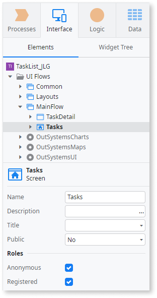
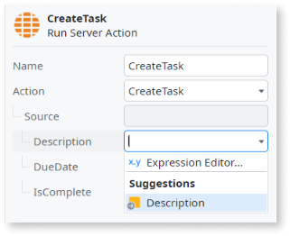
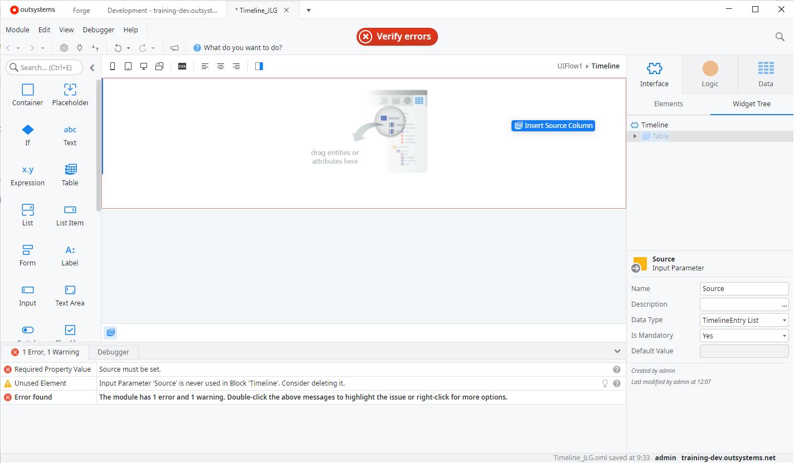
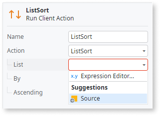
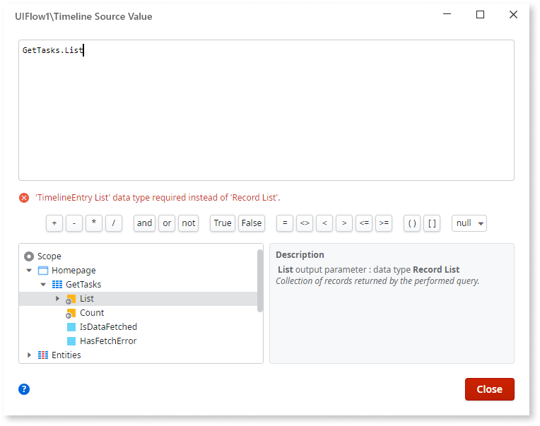
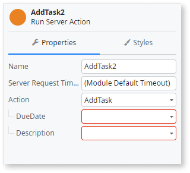

# **End-to-end tutorial for public EAP**

In this tutorial you will create three apps: a Web app called **Calendar** that will uses **TaskList** to provide service actions of creating tasks and changing their status, along with a library called **Timeline**.

Both TaskList and Timeline will contain reusable components available to every app during development. 

## Create TaskList

**TaskList** provides service actions which, among other things, can be used to expose a service to be reused by other applications inside the same OutSystems environment.

To create **TaskList**: 

1. Launch **Service Studio**, click **New Application**, and select **Web App** and click **Next**.  

 
 
2. In the next screen call the app **TaskList** and give it a short description. You may choose a color to customize the app’s interface and upload a customized icon. Then click **Create App**.  

### Create data model

Entities are elements that allow you to persist information in the database and to implement your database model. Think of them as database tables or views.  An Entity is defined through Entity Attributes that store the information related to it. Examples of entity attributes are Name, Address, Zip Code, City, among others.

Now we’re going to create an entity called **Task** with three attributes: **Description**, **DueDate**, and **IsCompleted**.

1. Go to the **Data** tab, right-click **Entities**, click **Add Entity**, and name it **Task**. 

 

2. Right-click the new **Task** entity, select **Add Entity Attribute**, and name it **Description**. 

 

3. Verify that OutSystems has correctly identified  **Data Type** of the new **Description** entity as** Text**. Change the entity **Length** to **100** and **Is Mandatory** to **Yes**. 

 

4. In the same way add an** Entity Attribute** called **DueDate** to the **Task** entity. Verify that Service Studio has identified its **Data Type** as **Date**. As above, set **Is Mandatory** to **Yes**.
5. Add a third **Entity Attribute** called **IsComplete** to the **Task** entity. Verify that **Service Studio** has identified its **Data Type** as **Boolean** and that **Is Mandatory** is set to **No**. 

 

### Create list and detail screens from **Task** entity

With the **Task** entity created, it is now time to give users a way to view and change items in the task list. 

1. Select the **Interface** tab, double-click **MainFlow**, and verify that **MainFlow** appears in the top right corner of the central working canvas. 

 

2. Return to the **Data** tab and drag the **Task** entity onto the **MainFlow** canvas.  

 

3. OutSystems creates two interface screens, as seen below. 

 

You may double-click either of the created screens to see how the entity has been expressed. The **Tasks** screen is shown below. 
    
 

### Change roles of screens to anonymous for testing

EAP reportedly will not have roles. They still appear in the interface, so they are documented here.

<

1. Go to the **Interface** tab and select **Tasks** in the **MainFlow**. Click **Anonymous** in the **Roles** area so it it is easier to test the app during development.

 

2. In the same manner, select **TaskDetail** in the **MainFlow** and click **Anonymous** in the **Roles** area. 

    

    During the publish process you will receive the following security warning: You're exposing a Server Action for public access and without authentication. Consider removing the Anonymous Role from this Screen.

    For most business apps, access to interface screens is restricted to registered users. Before deployment to the quality or production environments, the role of these screens should be changed back to the default so they are not anonymous.

    

3. Click the green **1-Click-Publish** button in the top center of the workspace so you can test your app to see if it works as expected.

When the app is published click the blue **Open in browser** button. There you can add a task, set it to completed, and verify that it appears as expected in the task list.

### Expose **Task** entity for use in other applications

In order for other apps to use the functionality of **TaskList**, it must be exposed for consumption.

1. From the **Data** tab select the **Task** entity and change the **Public** property to **Yes** so it can be consumed, or added as a dependency, to other apps.

 

2. In the **Logic** tab right-click **Service Actions** and click **Add Service Action** to create the **AddTask **service action.

 

3. Right-click the **AddTask **service action, select  **Add Input Parameter** and call it **DueDate**. Verify that OutSystems identifies its **Data Type** as **Date** and set **IsMandatory** to **Yes**.

 

4. In the same way, add a second input parameter to the **AddTask **service action and call it **Description**. Verify that OutSystems identifies its **Data Type** as **Text** and set **IsMandatory** to **Yes**.

 

5. Go to the **Data** tab and drag the **CreateTask** entity attribute to the flashing blue node in the **AddTask** logic flow.

 

6. Select the **CreateTask** entity action that you just dragged into the flow and expand the **Source** options in the property editor to view the required sources, **Description** and **DueDate**.

 

7. Click the **Description** dropdown and accept the option suggested by OutSystems.

 

8. In a like manner accept the option suggested by OutSystems in the **DueDate** dropdown.

 

Click the **1-Click Publish** button to make **TaskList** available for other apps.

## Create a library app

Intro: what is a library.

1. Close the TaskList app and create a new **Library** called **TimeLine**.

 

2. Add OutSystems UI as a dependency to the **Timeline** library.  First search for “OutSystems” in other apps.

 

All procedures and screens from this point forward are taken from O11 and must be changed. 

3. Select OutSystemUI and click **Add Dependency**.

 

4. In a like manner at the other three OutSystems UI themes:
    * OSUIMobileBase
    * OSUIMobiliePhone
    * OSUIMobileTablet
5. In the **Interface** tab right-click **UIFlow**, select **Add UI Flow** and give it the name **UIFlow1**. \
 

6. Click the **Theme** dropdown and select **OutsystemsUI**.

 

7. Create a reusable UI that has a table widget. Right-click **UIFlow1**, select **Add Block**, and name it **Timeline**.

 

8. Set the **Timeline** block **Public** property to **Yes** and then drag a **Table** widget to the canvas.  

 

### Create a source for the table

After you drag the table to the canvas, OutSystems warns you that it requires a source. Normally the source is an entity. However, entities are not available in library apps, and libraries must be stateless.

In this case the source is provided by input parameters and structures to receive data.

1. In the **Data** tab, right-click **Structures**, call it **TimelineEntry**, and set the **Public** attribute to **Yes**. 

 

2. Right-click the **TimelineEntry** structure, select **Add Structure Attribute**, call it **Description**, and set the **Is Mandatory** attribute to **Yes**. Verify that OutSystems identified its **Data Type** as **Text**.

 

3. In a similar manner, right-click the **TimelineEntry** structure, select **Add Structure Attribute**, and call it **Date**, and set the **Is Mandatory** attribute to **Yes**. Verify that OutSystems identified its **Data Type** as **Date**.

 

4. In the **Interface** tab right-click **Add Input Parameter** and call it **Source**.

 

5. Select the **Source** input parameter, scroll down the **Data Type** options, and select **List…

** 

6. In the **Element Type Window**, scroll down to the **Structures** folder, select the **TimelineEntry** structure you previously created, and click **Select**.

 

7. Drag the **Source** input parameter of the **Timeline** block to add two columns to the table and set the source of the the table to these input parameters.

 

8. Select the table in the canvas, click the **Event** dropdown, and select **onchange**.

  

A **New on Sort** is only available for aggregates that cannot be used in a library.

9. Right-click the **Timeline** block, select **Add Client Action**,  and call it **ListSort**.

 

10. Select the table in the canvas, click the **Handler** dropdown, and select **ListSort**.

  

11. Drag the **Run Client Action** widget from the toolbox to the flashing blue node in the logic flow on the canvas.

 

12. Scroll down to the **ListSort** action in the **Select Action** window and click **Select**.

 

13. With the **ListSort** action selected, click the **List** attribute dropdown and accept the OutSystems suggestion of **Source**.

 

14. In a like manner, select **Date** as the **By** attribute.

 

At this point click the **1-Click Publish** button to make this library available to other apps in your environment.

## Create a calendar app

The calendar app will use the library and service previously created. It will include:

* An onboarding screen
* Use the Timeline block of the library
* Show data from the DataList service

To create the calendar app:

1. Return to the Applications
2. Create Web app and name it **Calendar**.

### Create onboarding screen

With the **Calendar** app created, begin with adding an onboarding screen.

1. Drag the **Screen** widget from the toolbox to the canvas. 

 

2. In the **New Screen** window, choose the **Onboardings** category, select the **Onboarding** **with animation** template, and click **Create Screen**.

 

3. Click the **Get Started** button and change the default **On Click** event to **New Screen**.

 

4. In the **New Screen** window, select the **Empty** template, call it **HomePage**, and click **Create Screen**.

 

### Add Dependencies

The **Calendar** app uses UI elements from the library app and data from the service app. In order to use them they have to be added as dependencies, as follows:

1. Type **Timeline** in the search bar (in the upper right of the **Service Studio** workspace) and click **Search in other Modules**.

 

2. In the **Search in other Modules** window filter the search results by **Block** and select the **Timeline** app you created earlier. Then click **Add Dependency**.

 

3. The UI element brought in from the **Timeline** library now needs a source for its data, which the app can consume from the **Task** entity you created in the **TasksList** app you created earlier. So as before, search for **Task** in the search bar, select **Search in other Modules,** sort by **Entity**, select the **Task** entity from the **TasksList** app, and click **Add Dependency**.

 

4. Now add the functionality to add a task. Search for **AddTask**, as above, and then click **Add Dependency**.

 

### Use dependencies in Calendar

1. In the **Data** tab, drag the Data aggregate to the canvas. Then click **1-Click Publish**. 

 

2. Drag the **Timeline** block to the **MainContent** area in the **Homepage** canvas. 

 

The resulting table, as can be seen, requires a source for data. 
    
 

3. In the **Interface** tab right click **Homepage** and select **Fetch Data from Database** and call it **GetTasks**. 

 

4. With **Homepage** selected, click the table on the canvas and select **Expression Editor** from the **Source** dropdown. 

 

5. In the **Expression Editor** window double-click **List** under the **GetTasks** folder to add the expression GetTasks.List. Then click **Close**. 

 

6. Drag a **Button** widget to the **Click to add actions** area of the canvas change the button **Text** to **Add Tasks**. 

 

7. Double-click the new **Add Tasks** button to see the **AddTaskonClick** action flow in the canvas. From the **Logic** tab drag the **AddTask** server action to the flashing blue node.

 

8. Click the **DueDate** parameter dropdown and accept CurrDate(). In the **Description** parameter type an appropriate name such as **Calendar App**.

 

Now click the **1-Click Publish** button to test the app.

## Next steps

Customize UI styles

