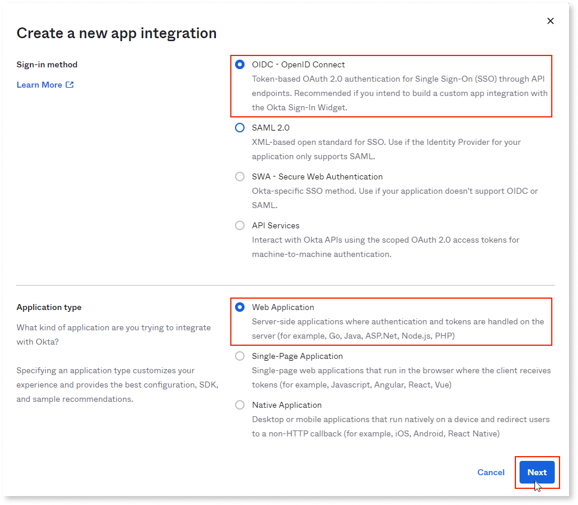
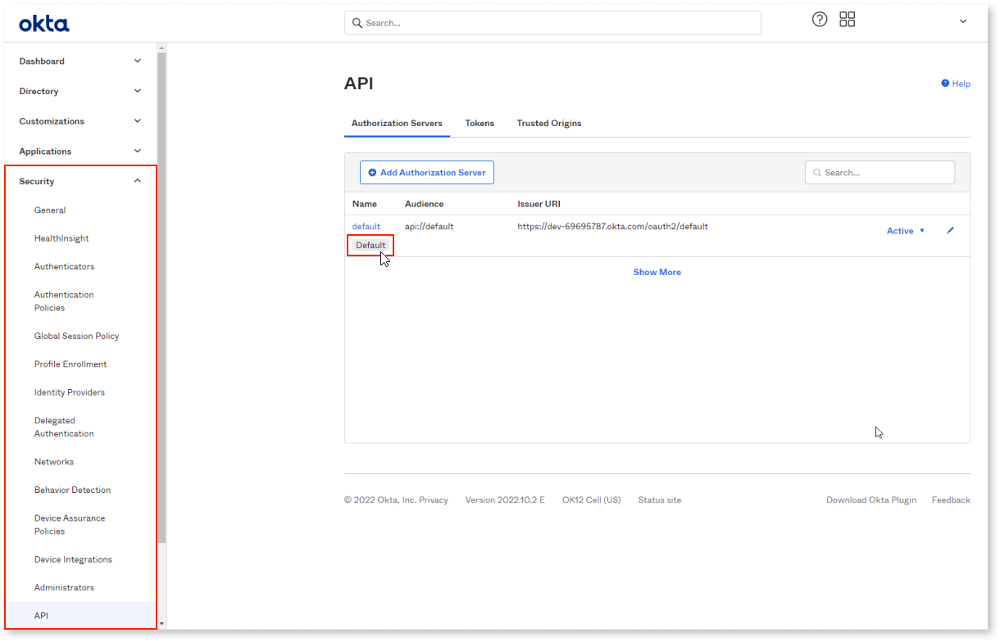
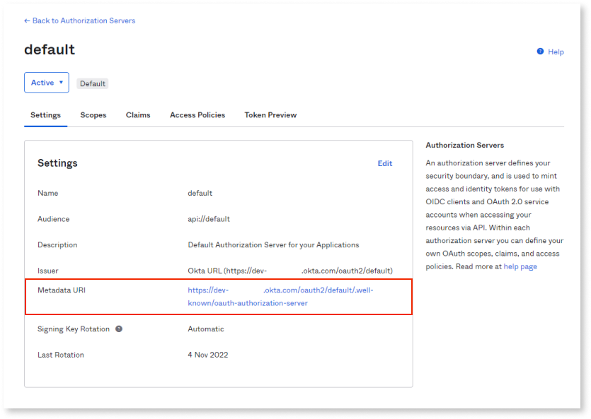
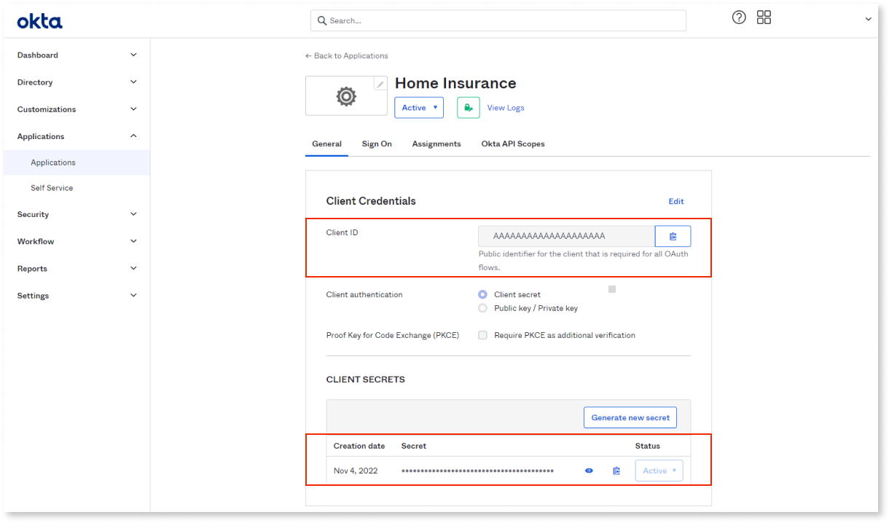
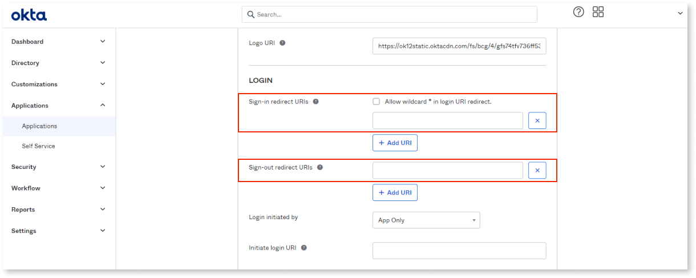

# Add Okta for use as an external identity provider

ODC admins can configure Azure AD as an external IdP by going to the ODC Portal and selecting the **Identity providers** tab. 

To launch the **New provider** configuration screen, click the **Add Provider** > **OpenID Connect** button. Now follow these steps:

1. Enter a name for the new provider in the **Provider name** field. This can be any name less than 255 characters and can't include special characters.

1. Login to the [**Okta Portal**](https://portal.azure.com/). Navigate to the **Applications > Applications** screen and click **Create App Integration** to create a new application.

    

1. In the **Create a new app integration** wizard, select **OIDC - OpenID Connect** under Sign-in method and **Web Application** under **Application type**. Click **Next**.

    

1. Add a name for your application and select **Skip group assignment for now** in the assignments section. Click **Save**.

1. Navigate to the **Security > API** screen and click **default** under the entry for the new application.

    

1. Copy the URL from the **Metadata URI** field and paste it into the **Discovery endpoint** field in ODC Portal.

    

1. Click **Get details** in **ODC Portal**. This retrieves the JSON of the Okta OpenID configuration and shows a preview.

1. Copy the value of the **Client ID** field from the main screen of the new application in Okta Portal and paste it into the **Client ID** field in ODC Portal. Repeat for the **Client Secret** field.

    

    

    ODC safely stores the configuration details in a secret manager.
    

1. Complete the configuration in ODC Portal by leaving the **PKCE** as the default value (**SHA-256**) and fields in **Claim Mapping** section as default values (**name**, **email**) and clicking **Save**.

ODC tests the configuration and on success adds Okta to the list of available providers. If the test fails, a notification with the error displays. 

Now follow the steps [here](intro.md#apply-an-external-idp) to apply for the newly added Okta provider for use by your organization or apps.

## Configure redirect URLs

To add permitted redirects for the Okta provider follow the steps below.

1. Click **Applications > Applications** in Okta Portal to navigate to the main screen of the new application. 

1. Select **General settings** and click **Edit**.

1. From ODC Portal, for the Platform and/or each app stage you applied the Okta provider, copy the **Authentication** URL(s) and them as individual URIs in the **Sign-in redirect URIs** section in Okta Portal. You should copy the URL(s) for both the built-in domain and any active [custom domains](../custom-domains.md).

1. Now for the Platform and/or each app stage you applied the Okta provider, copy the **Logout** URL(s) and then paste them as individual URIs in the **Sign-out redirect URIs** section in Okta Portal. You should copy the URL(s) for both the built-in domain and any active [custom domains](../custom-domains.md).

    

1. Click **Save**.

If you applied the newly added Okta provider for use in your apps, now follow the steps [here](intro.md#use-external-idp-in-an-app--in-an-app).
