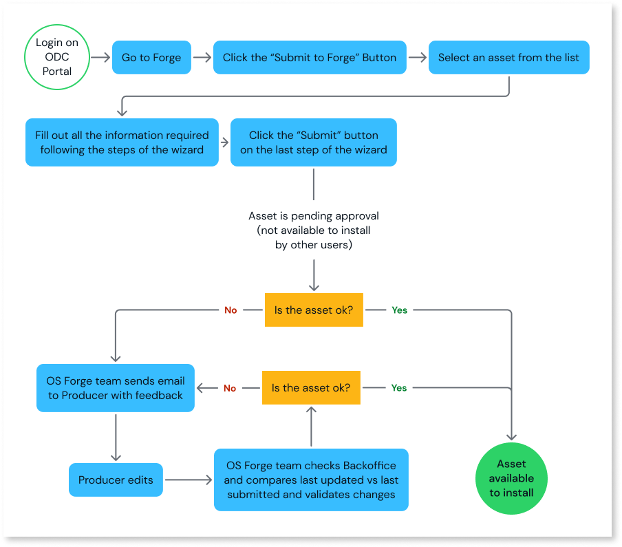

# Submit assets to Forge

Project Neo documentation is under construction. It's frequently updated and expanded.

Forge is a repository of reusable software assets that help overcome technical challenges and helps to solve business use cases. OutSystems enables you to easily and quickly learn how to build and share an asset in self-service and scale the number of out-of-the-box solutions in the community. Users who build assets in their organization can submit them seamlessly, while guided to follow the standards required by the Forge.

The following diagram shows the asset submission journey. The journey is slightly different for new assets and updates to existing assets. 

When you submit a new asset, it gets reviewed by the OutSystems Forge team to make sure it meets the requirements. The asset is added to the Forge Repository, and from the Portal, you can see it in Forge and edit the information on the detail page. The asset is only visible to you (the owner) and not to users outside your organization. Once it is approved all users outside your organization can access your asset. Users then see an **Install** button on the asset.

When a new version of the asset is submitted to Forge, it doesn't go through the approval process; it's immediately made available after submission. Other users see an **Update** button, indicating that a new version of the asset is available to install.

When you submit a library, it doesn't have to be in the Production environment. Libraries in Forge are automatically versioned. When a new version is submitted, the increase is on the patch.

## Prerequisites

To submit an asset, your asset must meet the following prerequisites:

* Asset names must be unique. The name can't be the same as a name used for a previously submitted Forge asset.
* Submit any dependencies first, because you can’t proceed with submission if you’re missing a dependency.
* Apps must be deployed to Production.
* Assets must have a short description which you can edit in Service Studio.
* The asset name of this version must be the same as its previous version.

## Submit an asset to Forge

You can submit assets to Forge without needing to upload your asset. When you access Forge, you see a list of developed assets to select from your organization context.

By default, the Asset name, the icon, and the short description are the ones defined during the development. You can change them in Service Studio and submit a new version with the changes. The short description displays on the asset's card.

1. Log into the Portal and select **Forge**, from the left-side menu. A list of assets available to install on your organization displays.  
1. On the top right, click the **Submit to Forge** button. A list of assets developed in your organization displays.
1. From this list of assets, select the one you want to submit. 
1. Enter a detailed summary of your asset. Make sure it fully describes the asset's features and the problem(s) it solves.
1. Add any limitations that might exist, such as images might not size correctly in some browsers. 
1. Add images that best illustrate the asset's features, main use cases, and behavior.
1. Add the team contact. 
1. Add clear and concise documentation to guide developers on how to install and configure the asset along with general instructions on how to use it. 
1. Click **Submit** to finalize the process.

## Submit a new asset version to Forge

When an asset gets updated, resubmit it to Forge to share the changes. Keep the following in mind:

* The updated asset must have the same name as the original asset.
* The updated asset doesn't need to be approved by OutSystems.
* For libraries, the version number automatically increases on the patch.

Follow these steps to submit a new version of your asset:

1. On the top right, click the **Submit to Forge** button. A list of assets developed in your organization displays. 
1. From this list, select the asset which has a new version to be submitted.
1. Enter release notes that describe the changes you made to the asset.
1. Enter a detailed summary of your asset. Make sure it fully describes the asset's features and the problem(s) it solves.
1. Add any limitations that might exist, such as images might not size correctly in some browsers.
1. Add images that best illustrate the asset's features, main use cases, and behavior.
1. Add the team contact.
1. Optionally, edit the documentation of the asset.
1. Click **Submit** to finalize the process.
