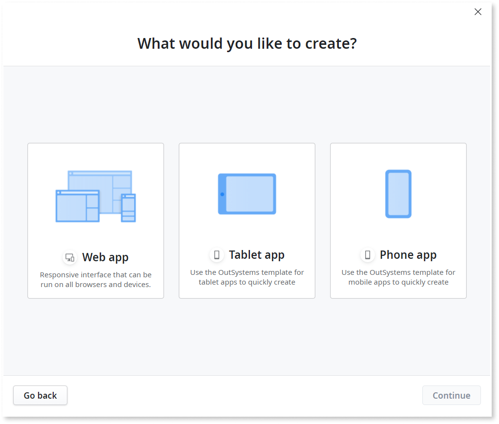
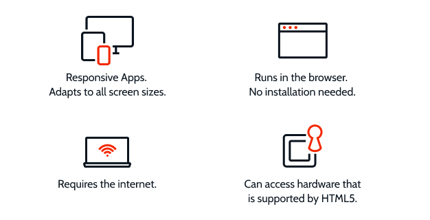

# Types of apps you can build

You can create several types of apps in OutSystems Developer Cloud (ODC). 

From ODC Portal, navigate to the **Apps** screen and click **Create app**. ODC Studio launches and the **What would you like to create?** window displays. Click **App** to see the options.

* Select **Web app** if you want to:
    * Create an app that users run mainly in a desktop browser, .
* Select **Phone app** or **Tablet app** if you want to: 
    * Create a mobile app to submit to Apple App Store or Google Play. You can also distribute a mobile app as a downloadable package to a group of users.
    * Create a lightweight app and share it as a Progressive Web App (PWA)(*) from your website. Users can put the app icon on their mobile home screen.

**Libraries** exist at the same level as apps and let you share code between apps. You can learn more about them in [App Architecture](../building-apps/architecture/intro.md#libraries-in-odc).

## What's a Web app?

In ODC, a Web app has a responsive interface that runs in the browser. The user experience is excellent across many types of devices and screen sizes.

When you develop a Web app:

* You can build apps using the client-side runtime and create responsive UX.
* Your apps run on a modern stack.

## What's a Mobile app?

In ODC, a Mobile App is an app that compiles to a native mobile Android or iOS app. 

You can develop for Android and iOS at the same time, as the underlying code is cross-platform. The default app templates of this type are **Phone app** and **Tablet app**.

There are two ways you can distribute a Mobile app:

* **Native app package** - A dedicated OutSystems cloud service generates native mobile builds for you, to distribute your app in the app stores or internally to a group of users.

* **Progressive Web App (PWA)**(*) - PWAs are lightweight apps that have the look and feel of native mobile apps. They're quick to distribute and install directly from your website, as they don't depend on the app stores. 

## Comparison between Web apps and Mobile apps

Here is a table comparing the features of Web apps and Mobile apps.

| |**Web app**  |**Mobile app** |
|:-:|:-:|:-:|
|**Code Reusability**| Common logic for all devices and screen sizes.| Common logic for all supported native mobile platforms, and supported browsers for PWAs.|
|**Runs in**| A browser. No installation is needed.| Native mobile apps run on Android and iOS devices. PWAs run on any device with a supported browser.|
|**User Experience**| Responsive layout for all screen sizes and types.| Dedicated mobile UI patterns and experiences.|
|**Access to device hardware**| HTML5 supported device capabilities.| Native mobile apps access a range of device capabilities through Cordova plugins. PWAs use dedicated plugins, which by design can access only hardware that the browser running the PWA is allowed to access.|
|**Offline capabilities**| No offline capabilities.| For storing offline data, native mobile apps use local storage(*) and PWAs use browser storage.|
|**Deployment and updates**| Updates are automatic when users refresh the browser page.| Native mobile apps can update automatically, and users need to install a new version only when you change the native shell. PWAs update automatically when the app detects a new version.|
|**Distribution**| Share the app link with users.|  You can distribute native mobile apps in-house or through the app stores. Users can run a PWA directly from your website, and add the app icon to the device home screen.|

(*) Currently not available.

