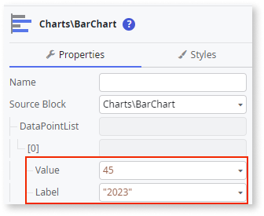
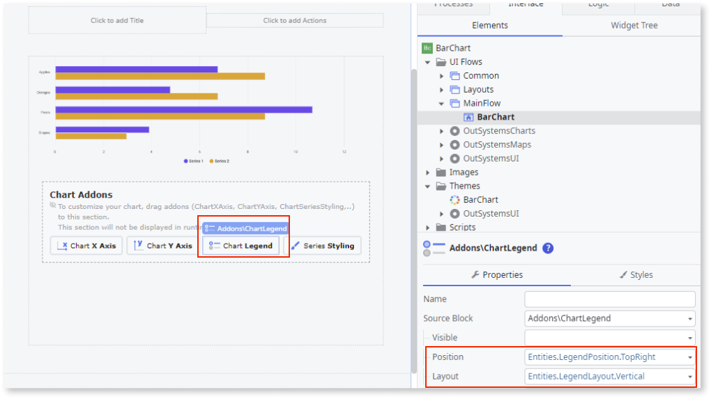
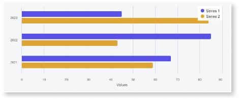

# Bar Chart

This example shows how you can create a simple Bar Chart with a customized legend.

1. From the Toolbox, drag the **Bar Chart** widget to the Screen.

    

1. On the **Properties** tab, click **[+]** to expand the **DataPointList** property.

    

1. Click **+[0]** and set the **Label** and **Value** properties using [fixed data](data.md#populate-your-chart-with-fixed-data) or [variable data](data.md#populate-your-chart-with-variable-data).

    This example uses fixed data. These properties define the first data point. Each data point corresponds to a point on the bar chart.

    

1. Set the **SeriesName** property.

    

1. To add more data points, repeat steps 2 and 3.

1. To customize the legend, in the **AddOns** placeholder, click **ChartLegend**, and on the **Properties** tab, set the **Position** property to **Entities.LegendPosition.TopRight** and the **Layout** to **Entities.LegendLayout.Vertical**.

    

1. Set the extra configurations to customize the legend.

    

After following these steps, you can publish your module:

