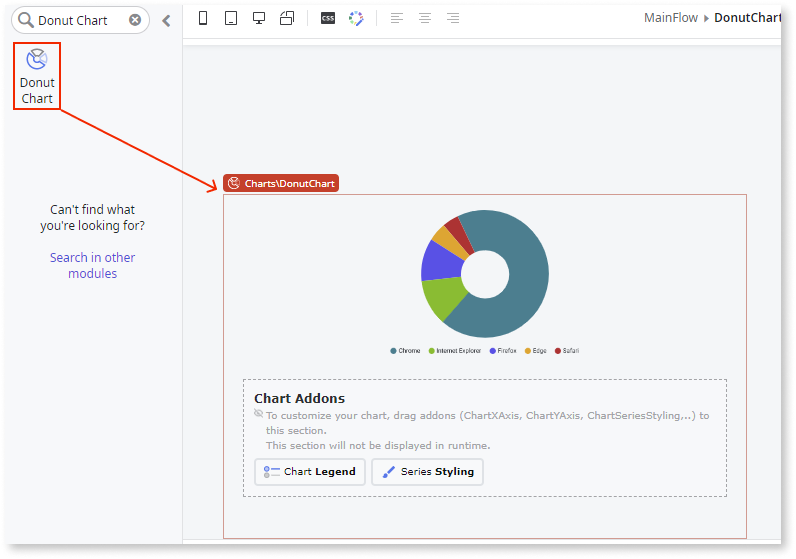
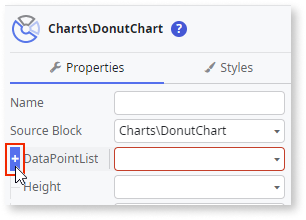
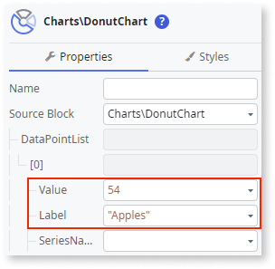
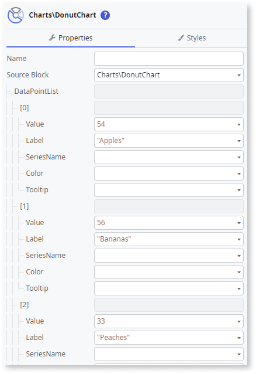

# Donut Chart

This example shows how you can create a simple Donut Chart.

1. From the Toolbox, drag the **Donut Chart** widget to the Screen.

    

1. On the **Properties** tab, click **[+]** to expand the **DataPointList** property.

    

1. Click **+[0]** and set the **Label** and **Value** properties using [fixed data](data.md#populate-your-chart-with-fixed-data) or [variable data](data.md#populate-your-chart-with-variable-data).

    This example uses fixed data. These properties define the first data point. Each data point corresponds to a slice on the donut chart. 

    

1. To add more data points, repeat steps 2 and 3.
    
    

1. To customize the inner size of the Donut Chart, set the value of the **InnerSize** property. 

    In this example, the **InnerSize** property is set to 60% (by default, the **InnerSize** property is 50%).

    

After following these steps, you can publish your module:

