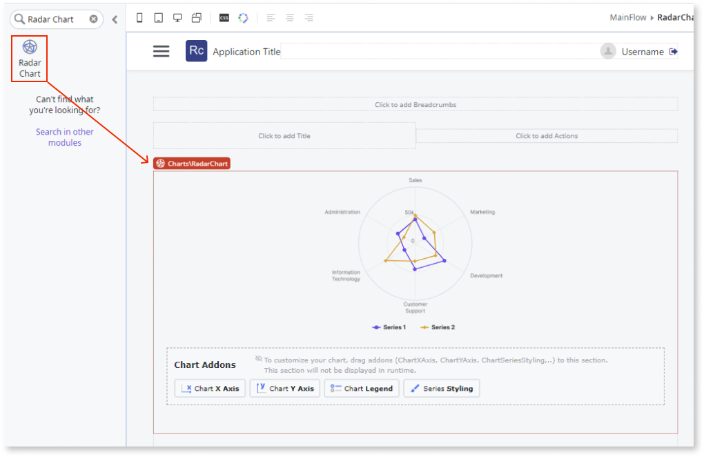
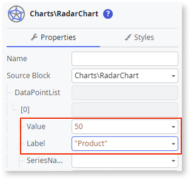
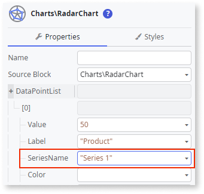
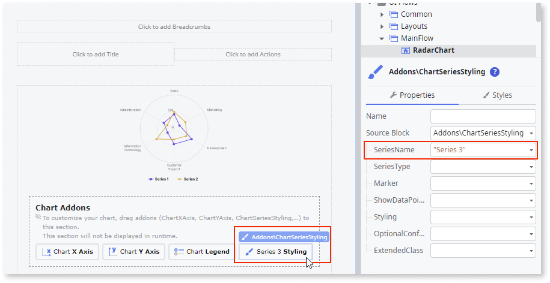

# Radar Chart

This example shows how you can create a simple Radar Chart with multiple series types.

1. From the Toolbox, drag the **Radar Chart** widget to the Screen.

    

1. On the **Properties** tab, click **[+]** to expand the **DataPointList** property.

    

1. Click **+[0]** and set the **Label** and **Value** properties using [fixed data](data.md#populate-your-chart-with-fixed-data) or [variable data](data.md#populate-your-chart-with-variable-data).

    This example uses fixed data. These properties define the first data point. Each data point corresponds to a point on the radar chart.  

    

1. Set the **SeriesName** property.

    

1. To add more data points, repeat steps 2 and 3. 

    

1. To customize a Series, in the AddOns placeholder, click **SeriesStyling** and on the **Properties** tab, set the **SeriesName** property to the Series you want to customize (in this example, Series 3).

    

1. To customize the Series type, on the **Properties** tab, set the **SeriesType** to **Entities.SeriesType.Area**. This sets the Series type to Area.  

    

After following these steps, you can publish your module:

